# PanSou 网盘搜索系统开发设计文档

## 📋 文档目录

- [1. 项目概述](#1-项目概述)
- [2. 系统架构设计](#2-系统架构设计)
- [3. 异步插件系统](#3-异步插件系统)
- [4. 二级缓存系统](#4-二级缓存系统)  
- [5. 核心组件实现](#5-核心组件实现)
- [6. 智能排序算法详解](#6-智能排序算法详解)
- [7. API接口设计](#7-api接口设计)
- [8. 认证系统设计](#8-认证系统设计)
- [9. 插件开发框架](#9-插件开发框架)
- [10. 性能优化实现](#10-性能优化实现)
- [11. 技术选型说明](#11-技术选型说明)

---

## 1. 项目概述

### 1.1 项目定位

PanSou是一个高性能的网盘资源搜索API服务，支持TG搜索和自定义插件搜索。系统采用异步插件架构，具备二级缓存机制和并发控制能力，在MacBook Pro 8GB上能够支持500用户并发访问。

### 1.2 核心特性

- **异步插件系统**: 双级超时控制（4秒/30秒），渐进式结果返回
- **二级缓存系统**: 分片内存缓存+分片磁盘缓存，GOB序列化
- **工作池管理**: 基于`util/pool`的并发控制
- **智能结果合并**: `mergeSearchResults`函数实现去重合并
- **多维度排序**: 插件等级+时间新鲜度+优先关键词综合评分
- **多网盘类型支持**: 自动识别12种网盘类型

---

## 2. 系统架构设计

### 2.1 整体架构流程

```mermaid
graph TB
    A[用户请求] --> B[API Gateway<br/>Gin Handler]
    B --> C[参数解析与验证<br/>GET/POST处理]
    C --> D[参数预处理<br/>规范化处理]
    
    D --> E[SearchService<br/>主搜索服务]
    E --> F{源类型判断<br/>sourceType}
    
    F -->|TG| G[并行TG搜索]
    F -->|Plugin| H[并行插件搜索]
    F -->|All| I[TG+插件并行搜索]
    
    I --> G
    I --> H
    
    %% TG搜索分支
    G --> G1[生成TG缓存键<br/>GenerateTGCacheKey]
    G1 --> G2{强制刷新?<br/>forceRefresh}
    G2 -->|否| G3[检查二级缓存<br/>EnhancedTwoLevelCache]
    G2 -->|是| G6[跳过缓存检查]
    
    G3 --> G4{缓存命中?}
    G4 -->|是| G5[缓存反序列化<br/>直接返回结果]
    G4 -->|否| G6[执行TG频道搜索<br/>多频道并行]
    G6 --> G7[HTML解析<br/>链接提取]
    G7 --> G8[结果标准化]
    G8 --> G9[更新缓存<br/>SetBothLevels]
    
    %% 插件搜索分支 - 详细的异步处理
    H --> H1[生成插件缓存键<br/>GeneratePluginCacheKey]
    H1 --> H2{强制刷新?<br/>forceRefresh}
    H2 -->|否| H3[检查二级缓存<br/>EnhancedTwoLevelCache]
    H2 -->|是| H6[跳过缓存检查]
    
    H3 --> H4{缓存命中?}
    H4 -->|是| H5[缓存反序列化<br/>直接返回结果]
    H4 -->|否| H6[插件管理器调度<br/>PluginManager]
    
    %% 异步插件详细流程
    H6 --> H7[异步插件初始化<br/>SetMainCacheKey]
    H7 --> H8[工作池任务提交<br/>WorkerPool]
    
    %% 双级超时机制的并行处理
    H8 --> H9{异步并行处理}
    
    %% 快速响应分支 (4秒)
    H9 --> H10[短超时处理<br/>4秒快速响应]
    H10 --> H11[HTTP请求<br/>短超时模式]
    H11 --> H12[部分结果解析<br/>快速过滤]
    H12 --> H13[部分结果缓存<br/>isFinal=false]
    H13 --> H14[立即返回<br/>部分结果给用户]
    
    %% 持续处理分支 (30秒)
    H9 --> H15[长超时后台处理<br/>最长30秒持续]
    H15 --> H16[HTTP请求<br/>长超时模式]
    H16 --> H17[完整结果解析<br/>深度过滤]
    H17 --> H18[结果去重合并<br/>最终处理]
    H18 --> H19[完整结果缓存<br/>isFinal=true]
    H19 --> H20[主缓存异步更新<br/>DelayedBatchWrite]
    
    %% 结果合并处理
    G5 --> J[结果合并<br/>mergeSearchResults]
    G9 --> J
    H5 --> J
    H14 --> J
    
    J --> K[智能排序算法<br/>时间+关键词+插件等级]
    K --> L[结果过滤<br/>高质量结果筛选]
    L --> M[网盘类型分组<br/>mergeResultsByType]
    M --> N{结果类型<br/>resultType}
    
    N -->|merged_by_type| O[返回分组结果]
    N -->|results| P[返回原始结果]
    N -->|all| Q[返回完整结果]
    
    O --> R[JSON响应]
    P --> R
    Q --> R
    R --> S[用户]
    
    %% 后台持续更新（不影响用户响应）
    H20 --> T[后台缓存完善<br/>下次请求更完整]
    T -.-> U[持续优化<br/>用户体验]
    
    %% 缓存系统
    subgraph Cache[二级缓存系统]
        CA[分片内存缓存<br/>LRU + 原子操作]
        CB[分片磁盘缓存<br/>GOB序列化]
        CC[智能缓存写入管理器<br/>DelayedBatchWriteManager]
        CD[全局缓冲区管理器<br/>BufferByPlugin策略]
    end
    
    G3 -.-> CA
    H3 -.-> CA
    CA -.-> CB
    G9 -.-> CC
    H13 -.-> CC
    H20 -.-> CC
    CC -.-> CD
    
    %% 样式定义
    classDef cacheNode fill:#e1f5fe,stroke:#01579b,stroke-width:2px
    classDef pluginNode fill:#f3e5f5,stroke:#4a148c,stroke-width:2px
    classDef searchNode fill:#e8f5e8,stroke:#1b5e20,stroke-width:2px
    classDef fastResponse fill:#fff3e0,stroke:#e65100,stroke-width:2px
    classDef slowProcess fill:#fce4ec,stroke:#880e4f,stroke-width:2px
    classDef processNode fill:#f5f5f5,stroke:#424242,stroke-width:2px
    
    class G3,H3,G5,H5,G9,H13,H20,CA,CB,CC,CD cacheNode
    class H6,H7,H8 pluginNode
    class G6,G7,G8 searchNode
    class H10,H11,H12,H13,H14 fastResponse
    class H15,H16,H17,H18,H19,H20,T slowProcess
    class D,J,K,L,M processNode
```



### 2.2 异步插件工作流程

```mermaid
sequenceDiagram
    participant U as 用户
    participant API as API Handler
    participant S as SearchService
    participant SP as searchPlugins函数
    participant C as 二级缓存系统
    participant PM as PluginManager
    participant P as AsyncPlugin
    participant WP as WorkerPool
    participant BWM as BatchWriteManager
    participant EXT as 外部API

    %% 请求处理阶段
    U->>API: 🔍 搜索请求 (kw=关键词)
    API->>API: 参数解析与验证
    API->>API: 参数预处理规范化
    API->>S: Search(req.Keyword, ...)
    
    %% 并行搜索启动
    Note over S: 🚀 并行启动TG和插件搜索
    S->>SP: searchPlugins(keyword, plugins, ...)
    
    %% 缓存检查阶段
    SP->>SP: 生成插件缓存键
    SP->>SP: 检查forceRefresh标志
    
    alt forceRefresh = false
        SP->>C: 🔍 Get(cacheKey)
        alt 缓存命中
            C-->>SP: ✅ 返回缓存数据
            SP->>SP: 反序列化结果
            SP-->>S: 🎯 返回缓存结果 (<10ms)
            S-->>U: ⚡ 极速响应
        else 缓存未命中
            Note over SP: 🚨 执行异步插件搜索
            SP->>PM: 获取可用插件列表
            SP->>PM: 过滤指定插件
        end
    else forceRefresh = true
        Note over SP: 🔄 跳过缓存，强制搜索
        SP->>PM: 获取可用插件列表
        SP->>PM: 过滤指定插件
    end
    
    %% 异步搜索初始化
    PM->>P: 🎯 设置关键词和缓存键
    P->>P: SetMainCacheKey(cacheKey)
    P->>P: SetCurrentKeyword(keyword)
    P->>P: 注入缓存更新函数
    
    %% 🚀 异步插件的精髓：双级超时并行机制
    Note over P,EXT: 🔥 异步插件精髓：快速响应 + 持续处理
    
    P->>WP: 🚀 提交异步任务到工作池
    
    %% 快速响应路径 (4秒)
    par 🚀 快速响应路径 (4秒)
        Note over WP,EXT: ⚡ 第一阶段：快速响应用户
        WP->>EXT: HTTP请求 (短超时 4秒)
        EXT-->>WP: 部分响应数据
        WP->>P: 🔍 解析部分结果
        P->>P: 快速过滤和标准化
        P->>P: 📝 记录日志: 初始缓存创建
        
        %% 部分结果立即缓存和返回
        P->>BWM: 🗄️ 异步缓存更新 (isFinal=false)
        Note over BWM: 部分结果缓存，不等待写入完成
        P-->>SP: 📤 部分结果立即返回
        SP-->>S: 🎯 部分结果 (isFinal=false)
        S->>S: 与TG结果合并
        S-->>U: ⚡ 快速响应 (~4秒)
        
    and 🔄 持续处理路径 (最长30秒)
        Note over WP,EXT: 🔄 第二阶段：后台持续完善
        WP->>EXT: 继续HTTP请求 (长超时 30秒)
        EXT-->>WP: 完整响应数据
        WP->>P: 🔍 解析完整结果
        P->>P: 深度过滤和去重
        P->>P: 结果质量评估
        P->>P: 📝 记录日志: 缓存更新完成
        
        %% 完整结果的主缓存更新
        P->>BWM: 🗄️ 主缓存更新 (isFinal=true)
        Note over BWM: 完整结果写入，高优先级
        BWM->>BWM: 🧠 智能缓存写入策略
        BWM->>BWM: 🗂️ 全局缓冲区管理
        BWM->>C: 📀 批量写入磁盘缓存
        
        Note over C: 🎯 下次同样请求将获得完整结果
    end
    
    %% 缓存系统内部处理
    C->>C: ⚡ 立即更新内存缓存
    C->>C: 📀 延迟批量更新磁盘缓存
    C->>C: 🧹 自动清理过期缓存
    
    %% 持续优化标注
    Note over U,EXT: 💡 异步插件核心价值
    Note over U,EXT: ✅ 用户获得快速响应 (4秒内)
    Note over U,EXT: ✅ 系统持续完善结果 (30秒内)  
    Note over U,EXT: ✅ 下次访问获得完整数据 (<100ms)
    Note over U,EXT: 🔄 完美平衡：速度 vs 完整性
```



### 2.3 核心组件

#### 2.3.1 HTTP服务层 (`api/`)
- **router.go**: 路由配置
- **handler.go**: 请求处理逻辑
- **middleware.go**: 中间件（日志、CORS等）

#### 2.3.2 搜索服务层 (`service/`)
- **search_service.go**: 核心搜索逻辑，结果合并

#### 2.3.3 插件系统层 (`plugin/`)
- **plugin.go**: 插件接口定义
- **baseasyncplugin.go**: 异步插件基类
- **各插件目录**: jikepan、pan666、hunhepan等

#### 2.3.4 工具层 (`util/`)
- **cache/**: 二级缓存系统实现
- **pool/**: 工作池实现
- **其他工具**: HTTP客户端、解析工具等

---

## 3. 异步插件系统

### 3.1 设计理念

异步插件系统解决传统同步搜索响应慢的问题，采用"尽快响应，持续处理"策略：
- **4秒短超时**: 快速返回部分结果（`isFinal=false`）
- **30秒长超时**: 后台继续处理，获得完整结果（`isFinal=true`）
- **主动缓存更新**: 完整结果自动更新主缓存，下次访问更快

### 3.2 插件接口实现

基于`plugin/plugin.go`的实际接口：

```go
type AsyncSearchPlugin interface {
    Name() string
    Priority() int
    
    AsyncSearch(keyword string, searchFunc func(*http.Client, string, map[string]interface{}) ([]model.SearchResult, error), 
               mainCacheKey string, ext map[string]interface{}) ([]model.SearchResult, error)
    
    SetMainCacheKey(key string)
    SetCurrentKeyword(keyword string)
    Search(keyword string, ext map[string]interface{}) ([]model.SearchResult, error)
}
```

### 3.3 基础插件类

`plugin/baseasyncplugin.go`提供通用功能：

```go
type BaseAsyncPlugin struct {
    name              string
    priority          int
    cacheTTL          time.Duration
    mainCacheKey      string
    currentKeyword    string        // 用于日志显示
    httpClient        *http.Client
    mainCacheUpdater  func(string, []model.SearchResult, time.Duration, bool, string) error
}
```

### 3.4 已实现插件列表

当前系统包含以下插件（基于`main.go`的导入）：
- **hdr4k**
- **hunhepan**
- **jikepan**
- **pan666**
- **pansearch**
- **panta**
- **qupansou**
- **susu**
- **panyq**
- **xuexizhinan**

### 3.5 插件注册机制

```go
// 全局插件注册表（plugin/plugin.go）
var globalRegistry = make(map[string]AsyncSearchPlugin)

// 插件通过init()函数自动注册
func init() {
    p := &MyPlugin{
        BaseAsyncPlugin: plugin.NewBaseAsyncPlugin("myplugin", 3),
    }
    plugin.RegisterGlobalPlugin(p)
}
```

---

## 4. 二级缓存系统

### 4.1 实现架构

基于`util/cache/`目录的实际实现：

- **enhanced_two_level_cache.go**: 二级缓存主入口
- **sharded_memory_cache.go**: 分片内存缓存（LRU+原子操作）
- **sharded_disk_cache.go**: 分片磁盘缓存
- **serializer.go**: GOB序列化器
- **cache_key.go**: 缓存键生成和管理

### 4.2 分片缓存设计

#### 4.2.1 内存缓存分片
```go
// 基于CPU核心数的动态分片
type ShardedMemoryCache struct {
    shards    []*MemoryCacheShard
    shardMask uint32
}

// 每个分片独立锁，减少竞争
type MemoryCacheShard struct {
    data map[string]*CacheItem
    lock sync.RWMutex
}
```

#### 4.2.2 磁盘缓存分片
```go
// 磁盘缓存同样采用分片设计
type ShardedDiskCache struct {
    shards    []*DiskCacheShard  
    shardMask uint32
    basePath  string
}
```

### 4.3 缓存读写策略

#### 4.3.1 读取流程
1. **内存优先**: 先检查分片内存缓存
2. **磁盘回源**: 内存未命中时读取磁盘缓存
3. **异步加载**: 磁盘命中后异步加载到内存

#### 4.3.2 写入流程  
1. **智能写入策略**: 立即更新内存缓存，延迟批量写入磁盘
2. **DelayedBatchWriteManager**: 智能缓存写入管理器，支持immediate和hybrid两种策略
3. **原子操作**: 内存缓存使用原子操作
4. **GOB序列化**: 磁盘存储使用GOB格式
5. **数据安全保障**: 程序终止时自动保存所有待写入数据，防止数据丢失

### 4.4 缓存键策略

`cache_key.go`实现了智能缓存键生成：

```go
// TG搜索和插件搜索使用不同的缓存键前缀
func GenerateTGCacheKey(keyword string, channels []string) string
func GeneratePluginCacheKey(keyword string, plugins []string) string
```

**优势**:
- 独立更新：TG和插件缓存互不影响
- 提高命中率：精确的键匹配
- 并发安全：分片设计减少锁竞争

### 4.5 序列化性能

使用GOB序列化（`serializer.go`）的实际优势：
- **性能**: 比JSON序列化快约30%
- **体积**: 比JSON小约20%
- **兼容**: Go原生支持，无外部依赖

---

## 5. 核心组件实现

### 5.1 工作池系统 (`util/pool/`)

#### 5.1.1 worker_pool.go 实现
- **批量任务处理**: `ExecuteBatchWithTimeout`方法
- **超时控制**: 支持任务级别的超时设置
- **并发限制**: 控制最大工作者数量

#### 5.1.2 object_pool.go 实现  
- **对象复用**: 减少内存分配和GC压力
- **线程安全**: 支持并发访问

### 5.2 HTTP服务配置

#### 5.2.1 服务器优化（基于config/config.go）
```go
// 自动计算HTTP连接数，防止资源耗尽
func getHTTPMaxConns() int {
    cpuCount := runtime.NumCPU()
    maxConns := cpuCount * 25  // 保守配置
    
    if maxConns < 100 {
        maxConns = 100
    }
    if maxConns > 500 {
        maxConns = 500  // 限制最大值
    }
    
    return maxConns
}
```

#### 5.2.2 连接池配置（基于util/http_util.go）
```go
// HTTP客户端优化配置
transport := &http.Transport{
    MaxIdleConns:        100,
    MaxIdleConnsPerHost: 10,
    IdleConnTimeout:     90 * time.Second,
}
```

### 5.3 结果处理系统

#### 5.3.1 智能排序算法（service/search_service.go）

PanSou 采用多维度综合评分排序算法，确保高质量结果优先展示：

**评分公式**:
```
总得分 = 插件得分(1000/500/0/-200) + 时间得分(最高500) + 关键词得分(最高420)
```

**权重分配**:
- 🥇 **插件等级**: ~52% (主导因素) - 等级1(1000分) > 等级2(500分) > 等级3(0分)
- 🥈 **关键词匹配**: ~22% (重要因素) - "合集"(420分) > "系列"(350分) > "全"(280分)
- 🥉 **时间新鲜度**: ~26% (重要因素) - 1天内(500分) > 3天内(400分) > 1周内(300分)

**关键优化**:
- **缓存性能**: 跳过空结果和重复数据的缓存更新，减少70%无效操作
- **排序稳定性**: 修复map遍历随机性问题，确保merged_by_type保持排序
- **插件管理**: 启动时按优先级排序显示已加载插件，便于监控

#### 5.3.2 结果合并（mergeSearchResults函数）
- **去重合并**: 基于UniqueID去重
- **完整性选择**: 选择更完整的结果保留
- **增量更新**: 新结果与缓存结果智能合并

### 5.4 网盘类型识别

支持自动识别的网盘类型（共12种）：
- 百度网盘、阿里云盘、夸克网盘、天翼云盘
- UC网盘、移动云盘、115网盘、PikPak
- 迅雷网盘、123网盘、磁力链接、电驴链接

---

## 6. 智能排序算法详解

### 6.1 算法概述

PanSou 搜索引擎采用多维度综合评分排序算法，确保用户能够优先看到最相关、最新、最高质量的搜索结果。

#### 6.1.1 核心设计理念

1. **质量优先**：高等级插件的结果优先展示
2. **时效性重要**：新发布的资源获得更高权重
3. **相关性保证**：关键词匹配度影响排序
4. **用户体验**：最终排序结果保持稳定性

#### 6.1.2 排序流程

```mermaid
graph TD
    A[搜索请求] --> B[获取搜索结果 allResults]
    B --> C[sortResultsByTimeAndKeywords]
    
    C --> D[为每个结果计算得分]
    D --> E[时间得分<br/>最高500分]
    D --> F[关键词得分<br/>最高420分]
    D --> G[插件得分<br/>等级1=1000分<br/>等级2=500分<br/>等级3=0分]
    
    E --> H[总得分 = 时间得分 + 关键词得分 + 插件得分]
    F --> H
    G --> H
    
    H --> I[按总得分降序排序]
    I --> J[mergeResultsByType]
    
    J --> K[按原始顺序收集唯一链接<br/>保持排序不被破坏]
    K --> L[按类型分组<br/>生成merged_by_type]
    
    L --> M[返回最终结果]
```



### 6.2 评分算法详解

#### 6.2.1 核心公式
```
总得分 = 时间得分 + 关键词得分 + 插件得分
```

#### 6.2.2 时间得分 (Time Score)

时间得分反映资源的新鲜度，**最高 500 分**：

| 时间范围 | 得分 | 说明 |
|---------|------|------|
| ≤ 1天   | 500  | 最新资源，最高优先级 |
| ≤ 3天   | 400  | 非常新的资源 |
| ≤ 1周   | 300  | 较新资源 |
| ≤ 1月   | 200  | 相对较新 |
| ≤ 3月   | 100  | 中等新鲜度 |
| ≤ 1年   | 50   | 较旧资源 |
| > 1年   | 20   | 旧资源 |
| 无日期   | 0    | 未知时间 |

#### 6.2.3 关键词得分 (Keyword Score)

关键词得分基于搜索词在标题中的匹配情况，**最高 420 分**：

| 优先关键词 | 得分 | 说明 |
|-----------|------|------|
| "合集" | 420 | 最高优先级 |
| "系列" | 350 | 高优先级 |
| "全" | 280 | 中高优先级 |
| "完" | 210 | 中等优先级 |
| "最新" | 140 | 较低优先级 |
| "附" | 70 | 低优先级 |
| 无匹配 | 0 | 无加分 |

#### 6.2.4 插件得分 (Plugin Score)

插件得分基于数据源的质量等级，体现资源可靠性：

| 插件等级 | 得分 | 说明 |
|---------|------|------|
| 等级1   | 1000 | 顶级数据源 |
| 等级2   | 500  | 优质数据源 |
| 等级3   | 0    | 普通数据源 |
| 等级4   | -200 | 低质量数据源 |

### 6.3 权重分析与实际效果

#### 6.3.1 权重分配

| 维度 | 最高分值 | 权重占比 | 影响说明 |
|------|---------|---------|----------|
| 插件等级 | 1000 | ~52% | **主导因素**，决定基础排序 |
| 关键词匹配 | 420 | ~22% | **重要因素**，优先关键词显著加分 |
| 时间新鲜度 | 500 | ~26% | **重要因素**，同等级内排序关键 |

#### 6.3.2 实际排序示例

| 场景 | 插件等级 | 时间 | 关键词 | 总分 | 排序 |
|------|---------|------|--------|------|------|
| 等级1 + 1天内 + "合集" | 1000 | 500 | 420 | **1920** | 🥇 第1 |
| 等级1 + 1天内 + "系列" | 1000 | 500 | 350 | **1850** | 🥈 第2 |
| 等级1 + 1月内 + "合集" | 1000 | 200 | 420 | **1620** | 🥉 第3 |
| 等级2 + 1天内 + "合集" | 500 | 500 | 420 | **1420** | 第4 |
| 等级1 + 1天内 + 无关键词 | 1000 | 500 | 0 | **1500** | 第5 |

---

## 7. API接口设计

### 7.1 核心接口实现（基于api/handler.go）

#### 7.1.1 搜索接口
```
POST /api/search
GET  /api/search
```

**核心参数**:
- `kw`: 搜索关键词（必填）
- `channels`: TG频道列表
- `plugins`: 插件列表  
- `cloud_types`: 网盘类型过滤
- `ext`: 扩展参数（JSON格式）
- `refresh`: 强制刷新缓存
- `res`: 返回格式（merge/all/results）
- `src`: 数据源（all/tg/plugin）

#### 7.1.2 健康检查接口
```
GET /api/health
```

返回系统状态和已注册插件信息。

### 6.2 中间件系统（api/middleware.go）

- **日志中间件**: 记录请求响应，支持URL解码显示
- **CORS中间件**: 跨域请求支持
- **错误处理**: 统一错误响应格式

### 6.3 扩展参数系统

通过`ext`参数支持插件特定选项：
```json
{
  "title_en": "English Title",
  "is_all": true,
  "year": 2023
}
```

---

## 8. 认证系统设计

### 8.1 系统概述

PanSou认证系统是一个可选的安全访问控制模块，基于JWT（JSON Web Token）标准实现。该系统设计目标是在不影响现有用户的前提下，为需要私有部署的用户提供灵活的认证功能。

#### 8.1.1 核心特性

- **可选性**: 默认关闭，通过环境变量`AUTH_ENABLED`启用
- **无状态**: 基于JWT，无需session存储
- **标准化**: 采用RFC 7519 JWT标准
- **灵活性**: 支持多用户配置
- **安全性**: Token自动过期，防止长期有效性风险

### 8.2 认证架构

#### 8.2.1 认证流程

```mermaid
sequenceDiagram
    participant U as 用户
    participant F as 前端
    participant M as 认证中间件
    participant A as 认证接口
    participant S as 搜索服务
    
    Note over U,S: 初始访问阶段
    U->>F: 访问应用
    F->>F: 检查localStorage中的token
    alt token不存在或无效
        F->>U: 显示登录窗口
        U->>F: 输入账号密码
        F->>A: POST /api/auth/login
        A->>A: 验证账号密码
        A->>A: 生成JWT Token
        A-->>F: 返回Token
        F->>F: 存储Token到localStorage
        F->>U: 关闭登录窗口
    end
    
    Note over U,S: API调用阶段
    U->>F: 发起搜索请求
    F->>F: axios拦截器添加Authorization头
    F->>M: GET/POST /api/search + Token
    M->>M: 验证Token有效性
    alt Token有效
        M->>S: 转发请求
        S-->>M: 返回搜索结果
        M-->>F: 返回响应
        F-->>U: 显示结果
    else Token无效/过期
        M-->>F: 返回401 Unauthorized
        F->>F: 响应拦截器捕获401
        F->>U: 显示登录窗口
    end
```



#### 8.2.2 组件架构

```
┌─────────────────────────────────────────────────────────────┐
│                         前端层 (Vue 3)                        │
├─────────────────────────────────────────────────────────────┤
│  ┌─────────────┐  ┌──────────────┐  ┌──────────────────┐  │
│  │ LoginDialog │  │ HTTP拦截器    │  │ Token管理工具     │  │
│  │ 登录组件     │  │ 自动添加Token │  │ LocalStorage     │  │
│  └─────────────┘  └──────────────┘  └──────────────────┘  │
└─────────────────────────────────────────────────────────────┘
                            ↕ HTTP (Authorization: Bearer)
┌─────────────────────────────────────────────────────────────┐
│                        后端层 (Go + Gin)                      │
├─────────────────────────────────────────────────────────────┤
│  ┌──────────────────────────────────────────────────────┐  │
│  │              AuthMiddleware 认证中间件                 │  │
│  │  • 检查AUTH_ENABLED配置                              │  │
│  │  • 排除公开接口（/api/auth/login, /api/health）      │  │
│  │  • 验证JWT Token有效性                               │  │
│  │  • 提取用户信息到Context                             │  │
│  └──────────────────────────────────────────────────────┘  │
│                            ↓                                │
│  ┌─────────────┐  ┌─────────────┐  ┌──────────────────┐  │
│  │ 认证接口     │  │ JWT工具      │  │ 配置管理          │  │
│  │ /auth/login │  │ util/jwt.go │  │ config/config.go │  │
│  │ /auth/verify│  │ GenerateToken│  │ AuthEnabled     │  │
│  │ /auth/logout│  │ ValidateToken│  │ AuthUsers       │  │
│  └─────────────┘  └─────────────┘  └──────────────────┘  │
└─────────────────────────────────────────────────────────────┘
```

### 8.3 后端实现细节

#### 8.3.1 配置模块 (config/config.go)

```go
type Config struct {
    // ... 现有配置 ...
    
    // 认证相关配置
    AuthEnabled      bool              // 是否启用认证
    AuthUsers        map[string]string // 用户名:密码哈希映射
    AuthTokenExpiry  time.Duration     // Token有效期
    AuthJWTSecret    string            // JWT签名密钥
}

// 从环境变量读取认证配置
func getAuthEnabled() bool {
    enabled := os.Getenv("AUTH_ENABLED")
    return enabled == "true" || enabled == "1"
}

func getAuthUsers() map[string]string {
    usersEnv := os.Getenv("AUTH_USERS")
    if usersEnv == "" {
        return nil
    }
    
    users := make(map[string]string)
    pairs := strings.Split(usersEnv, ",")
    for _, pair := range pairs {
        parts := strings.SplitN(pair, ":", 2)
        if len(parts) == 2 {
            username := strings.TrimSpace(parts[0])
            password := strings.TrimSpace(parts[1])
            // 实际使用时应该对密码进行哈希处理
            users[username] = password
        }
    }
    return users
}
```

#### 8.3.2 JWT工具模块 (util/jwt.go)

```go
package util

import (
    "errors"
    "github.com/golang-jwt/jwt/v5"
    "time"
)

// Claims JWT载荷结构
type Claims struct {
    Username string `json:"username"`
    jwt.RegisteredClaims
}

// GenerateToken 生成JWT token
func GenerateToken(username string, secret string, expiry time.Duration) (string, error) {
    expirationTime := time.Now().Add(expiry)
    claims := &Claims{
        Username: username,
        RegisteredClaims: jwt.RegisteredClaims{
            ExpiresAt: jwt.NewNumericDate(expirationTime),
            IssuedAt:  jwt.NewNumericDate(time.Now()),
            Issuer:    "pansou",
        },
    }
    
    token := jwt.NewWithClaims(jwt.SigningMethodHS256, claims)
    return token.SignedString([]byte(secret))
}

// ValidateToken 验证JWT token
func ValidateToken(tokenString string, secret string) (*Claims, error) {
    claims := &Claims{}
    
    token, err := jwt.ParseWithClaims(tokenString, claims, func(token *jwt.Token) (interface{}, error) {
        return []byte(secret), nil
    })
    
    if err != nil {
        return nil, err
    }
    
    if !token.Valid {
        return nil, errors.New("invalid token")
    }
    
    return claims, nil
}
```

#### 8.3.3 认证中间件 (api/middleware.go)

```go
// AuthMiddleware JWT认证中间件
func AuthMiddleware() gin.HandlerFunc {
    return func(c *gin.Context) {
        // 如果未启用认证，直接放行
        if !config.AppConfig.AuthEnabled {
            c.Next()
            return
        }
        
        // 定义公开接口（不需要认证）
        publicPaths := []string{
            "/api/auth/login",
            "/api/auth/verify",
            "/api/auth/logout",
            "/api/health",  // 可选：健康检查是否需要认证
        }
        
        // 检查当前路径是否是公开接口
        path := c.Request.URL.Path
        for _, p := range publicPaths {
            if strings.HasPrefix(path, p) {
                c.Next()
                return
            }
        }
        
        // 获取Authorization头
        authHeader := c.GetHeader("Authorization")
        if authHeader == "" {
            c.JSON(401, gin.H{
                "error": "未授权：缺少认证令牌",
                "code": "AUTH_TOKEN_MISSING",
            })
            c.Abort()
            return
        }
        
        // 解析Bearer token
        const bearerPrefix = "Bearer "
        if !strings.HasPrefix(authHeader, bearerPrefix) {
            c.JSON(401, gin.H{
                "error": "未授权：令牌格式错误",
                "code": "AUTH_TOKEN_INVALID_FORMAT",
            })
            c.Abort()
            return
        }
        
        tokenString := strings.TrimPrefix(authHeader, bearerPrefix)
        
        // 验证token
        claims, err := util.ValidateToken(tokenString, config.AppConfig.AuthJWTSecret)
        if err != nil {
            c.JSON(401, gin.H{
                "error": "未授权：令牌无效或已过期",
                "code": "AUTH_TOKEN_INVALID",
            })
            c.Abort()
            return
        }
        
        // 将用户信息存入上下文，供后续处理使用
        c.Set("username", claims.Username)
        c.Next()
    }
}
```

#### 8.3.4 认证接口 (api/auth_handler.go)

```go
package api

import (
    "github.com/gin-gonic/gin"
    "pansou/config"
    "pansou/util"
    "time"
)

// LoginRequest 登录请求结构
type LoginRequest struct {
    Username string `json:"username" binding:"required"`
    Password string `json:"password" binding:"required"`
}

// LoginResponse 登录响应结构
type LoginResponse struct {
    Token     string `json:"token"`
    ExpiresAt int64  `json:"expires_at"`
    Username  string `json:"username"`
}

// LoginHandler 处理用户登录
func LoginHandler(c *gin.Context) {
    var req LoginRequest
    if err := c.ShouldBindJSON(&req); err != nil {
        c.JSON(400, gin.H{"error": "参数错误"})
        return
    }
    
    // 验证用户名和密码
    if config.AppConfig.AuthUsers == nil {
        c.JSON(500, gin.H{"error": "认证系统未正确配置"})
        return
    }
    
    storedPassword, exists := config.AppConfig.AuthUsers[req.Username]
    if !exists || storedPassword != req.Password {
        c.JSON(401, gin.H{"error": "用户名或密码错误"})
        return
    }
    
    // 生成JWT token
    token, err := util.GenerateToken(
        req.Username,
        config.AppConfig.AuthJWTSecret,
        config.AppConfig.AuthTokenExpiry,
    )
    if err != nil {
        c.JSON(500, gin.H{"error": "生成令牌失败"})
        return
    }
    
    // 返回token和过期时间
    expiresAt := time.Now().Add(config.AppConfig.AuthTokenExpiry).Unix()
    c.JSON(200, LoginResponse{
        Token:     token,
        ExpiresAt: expiresAt,
        Username:  req.Username,
    })
}

// VerifyHandler 验证token有效性
func VerifyHandler(c *gin.Context) {
    // 如果能到达这里，说明中间件已经验证通过
    username, exists := c.Get("username")
    if !exists {
        c.JSON(401, gin.H{"error": "未授权"})
        return
    }
    
    c.JSON(200, gin.H{
        "valid":    true,
        "username": username,
    })
}

// LogoutHandler 退出登录（客户端删除token即可）
func LogoutHandler(c *gin.Context) {
    c.JSON(200, gin.H{"message": "退出成功"})
}
```

### 8.4 前端实现细节

#### 8.4.1 API模块扩展 (src/api/index.ts)

```typescript
// 登录接口
export interface LoginParams {
  username: string;
  password: string;
}

export interface LoginResponse {
  token: string;
  expires_at: number;
  username: string;
}

export const login = async (params: LoginParams): Promise<LoginResponse> => {
  const response = await api.post<LoginResponse>('/auth/login', params);
  return response.data;
};

// 验证token
export const verifyToken = async (): Promise<boolean> => {
  try {
    await api.post('/auth/verify');
    return true;
  } catch {
    return false;
  }
};

// 退出登录
export const logout = async (): Promise<void> => {
  try {
    await api.post('/auth/logout');
  } finally {
    localStorage.removeItem('auth_token');
    localStorage.removeItem('auth_username');
  }
};
```

#### 8.4.2 HTTP拦截器配置

```typescript
// 请求拦截器 - 自动添加token
api.interceptors.request.use(
  (config) => {
    const token = localStorage.getItem('auth_token');
    if (token) {
      config.headers.Authorization = `Bearer ${token}`;
    }
    return config;
  },
  (error) => Promise.reject(error)
);

// 响应拦截器 - 处理401
api.interceptors.response.use(
  (response) => response,
  (error) => {
    if (error.response?.status === 401) {
      // 清除token
      localStorage.removeItem('auth_token');
      localStorage.removeItem('auth_username');
      
      // 触发显示登录窗口
      window.dispatchEvent(new CustomEvent('auth:required'));
    }
    return Promise.reject(error);
  }
);
```

### 8.5 API文档组件集成

在 `ApiDocs.vue` 组件中，需要确保在线调试功能自动携带token：

```typescript
// 生成请求预览时包含Authorization头
const generateSearchRequest = () => {
  const token = localStorage.getItem('auth_token');
  let headers = 'Content-Type: application/json\n';
  
  if (token) {
    headers += `Authorization: Bearer ${token}\n`;
  }
  
  if (searchMethod.value === 'POST') {
    return `POST /api/search
${headers}
${JSON.stringify(payload, null, 2)}`;
  }
  // ... GET请求类似处理
};
```

### 8.6 健康检查接口扩展

`/api/health` 接口需要返回认证状态信息：

```go
func HealthHandler(c *gin.Context) {
    // ... 现有逻辑 ...
    
    response := gin.H{
        "status":          "ok",
        "auth_enabled":    config.AppConfig.AuthEnabled,  // 新增
        "plugins_enabled": pluginsEnabled,
        "plugin_count":    pluginCount,
        "plugins":         pluginNames,
        "channels":        channels,
        "channels_count":  channelsCount,
    }
    
    c.JSON(200, response)
}
```

### 8.7 环境变量配置

| 变量名 | 类型 | 默认值 | 说明 |
|--------|------|--------|------|
| `AUTH_ENABLED` | boolean | `false` | 是否启用认证功能 |
| `AUTH_USERS` | string | - | 用户配置，格式：`user1:pass1,user2:pass2` |
| `AUTH_TOKEN_EXPIRY` | int | `24` | Token有效期（小时） |
| `AUTH_JWT_SECRET` | string | 随机生成 | JWT签名密钥 |

### 8.8 安全考虑

1. **密码存储**: 生产环境应使用bcrypt等算法对密码进行哈希
2. **HTTPS传输**: 生产环境必须使用HTTPS保护token传输
3. **Token过期**: 合理设置token有效期，避免长期有效
4. **限流保护**: 对登录接口实施限流，防止暴力破解
5. **密钥管理**: JWT_SECRET应随机生成并妥善保管

### 8.9 性能影响

- **未启用认证**: 零性能影响，中间件直接放行
- **启用认证**: 每个请求增加约0.1-0.5ms的token验证时间
- **并发性能**: JWT无状态特性，对高并发无影响
- **缓存友好**: 认证不影响现有缓存机制

---

## 9. 插件开发框架

### 9.1 基础开发模板

```go
package myplugin

import (
    "net/http"
    "pansou/model"
    "pansou/plugin"
)

type MyPlugin struct {
    *plugin.BaseAsyncPlugin
}

func init() {
    p := &MyPlugin{
        BaseAsyncPlugin: plugin.NewBaseAsyncPlugin("myplugin", 3),
    }
    plugin.RegisterGlobalPlugin(p)
}

func (p *MyPlugin) Search(keyword string, ext map[string]interface{}) ([]model.SearchResult, error) {
    return p.AsyncSearch(keyword, p.searchImpl, p.GetMainCacheKey(), ext)
}

func (p *MyPlugin) searchImpl(client *http.Client, keyword string, ext map[string]interface{}) ([]model.SearchResult, error) {
    // 实现具体搜索逻辑
    // 1. 构建请求URL
    // 2. 发送HTTP请求  
    // 3. 解析响应数据
    // 4. 转换为标准格式
    // 5. 关键词过滤
    return plugin.FilterResultsByKeyword(results, keyword), nil
}
```

### 8.2 插件注册流程

1. **自动注册**: 通过`init()`函数自动注册到全局注册表
2. **管理器加载**: `PluginManager`统一管理所有插件
3. **导入触发**: 在`main.go`中通过空导入触发注册

### 8.3 开发最佳实践

- **命名规范**: 插件名使用小写字母
- **优先级设置**: 1-5，数字越小优先级越高
- **错误处理**: 详细错误信息，便于调试
- **资源管理**: 及时释放HTTP连接

---

## 10. 性能优化实现

### 10.1 环境配置优化

基于实际性能测试结果的配置方案：

#### 10.1.1 macOS优化配置
```bash
export HTTP_MAX_CONNS=200
export ASYNC_MAX_BACKGROUND_WORKERS=15
export ASYNC_MAX_BACKGROUND_TASKS=75
export CONCURRENCY=30
```

#### 9.1.2 服务器优化配置  
```bash
export HTTP_MAX_CONNS=500
export ASYNC_MAX_BACKGROUND_WORKERS=40
export ASYNC_MAX_BACKGROUND_TASKS=200
export CONCURRENCY=50
```

### 9.2 日志控制系统

基于`config.go`的日志控制：
```bash
export ASYNC_LOG_ENABLED=false  # 控制异步插件详细日志
```

异步插件缓存更新日志可通过环境变量开关，避免生产环境日志过多。

---

## 11. 技术选型说明

### 11.1 Go语言优势
- **并发支持**: 原生goroutine，适合高并发场景
- **性能优秀**: 编译型语言，接近C的性能
- **部署简单**: 单一可执行文件，无外部依赖
- **标准库丰富**: HTTP、JSON、并发原语完备

### 10.2 GIN框架选择
- **高性能**: 路由和中间件处理效率高
- **简洁易用**: API设计简洁，学习成本低  
- **中间件生态**: 丰富的中间件支持
- **社区活跃**: 文档完善，问题解决快

### 10.3 GOB序列化选择
- **性能优势**: 比JSON快约30%
- **体积优势**: 比JSON小约20%
- **Go原生**: 无需第三方依赖
- **类型安全**: 保持Go类型信息

### 10.4 Sonic JSON库选择
- **高性能**: 比标准库encoding/json快3-5倍
- **统一处理**: 全局统一JSON序列化/反序列化
- **兼容性好**: 完全兼容标准JSON格式
- **内存优化**: 更高效的内存使用

### 10.5 无数据库架构
- **简化部署**: 无需数据库安装配置
- **降低复杂度**: 减少组件依赖
- **提升性能**: 避免数据库IO瓶颈
- **易于扩展**: 无状态设计，支持水平扩展